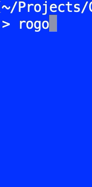

# Sudoku Solver

## Version
- v0.1.0 - October 12, 2020
- macOS, Linux, Windows
- [MIT License](LICENSE)
- By Abe Pralle

## About

A Sudoku-solving base framework. Currently the puzzle is hard-coded. Currently only implements solving through direct inferencing where at each point there is at least one empty cell which has only one possible value after other candidates have been eliminated by cross-referencing the row, column, and square that the cell is in.

## Installation
1. Install the [Rogue](https://github.com/AbePralle/Rogue) language.
2. Run `rogo` in this folder to compile and run **SudokuSolver**.
